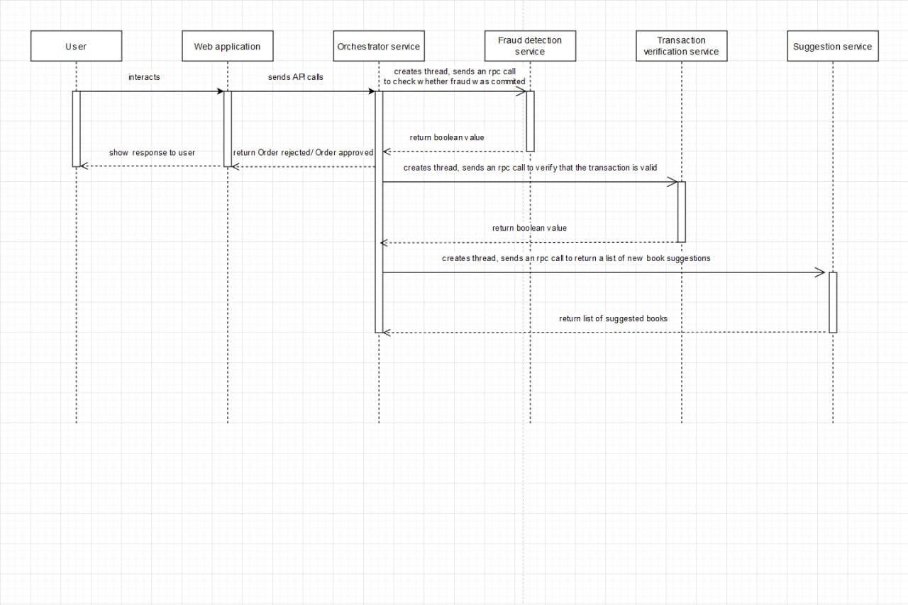
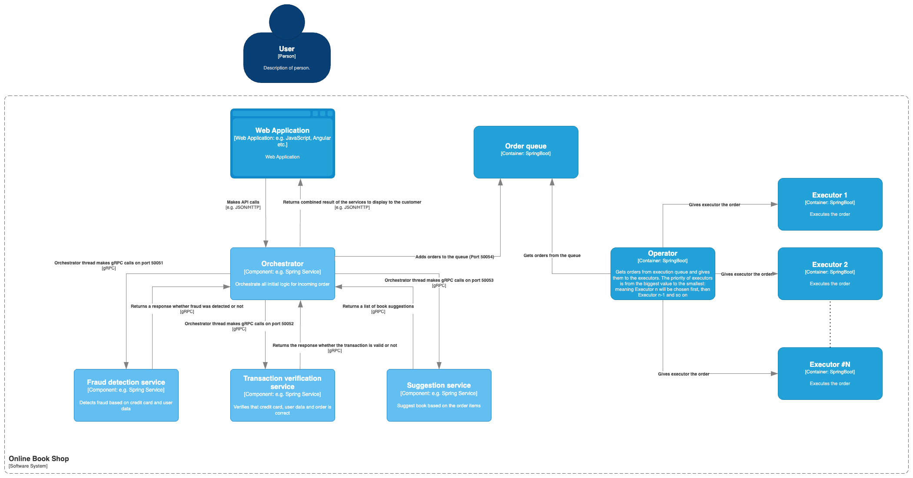
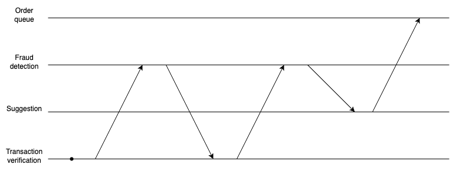
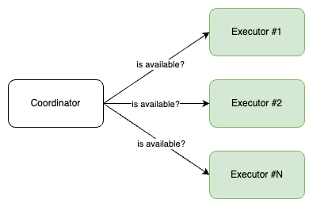
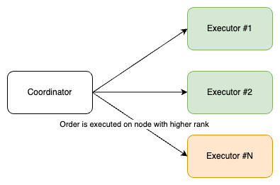
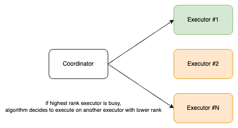

# Distributed Systems @ University of Tartu

This repository contains the initial code for the practice sessions of the Distributed Systems course at the University of Tartu.

## Getting started

### Overview

The code consists of multiple services. Each service is located in a separate folder. The `frontend` service folder contains a Dockerfile and the code for an example bookstore application. Each backend service folder (e.g. `orchestrator` or `fraud_detection`) contains a Dockerfile, a requirements.txt file and the source code of the service. During the practice sessions, you will implement the missing functionality in these backend services, or extend the backend with new services.

There is also a `utils` folder that contains some helper code or specifications that are used by multiple services. Check the `utils` folder for more information.

### Running the code with Docker Compose [recommended]

To run the code, you need to clone this repository, make sure you have Docker and Docker Compose installed, and run the following command in the root folder of the repository:

```bash
docker compose up
```

This will start the system with the multiple services. Each service will be restarted automatically when you make changes to the code, so you don't have to restart the system manually while developing. If you want to know how the services are started and configured, check the `docker-compose.yaml` file.

The checkpoint evaluations will be done using the code that is started with Docker Compose, so make sure that your code works with Docker Compose.

If, for some reason, changes to the code are not reflected, try to force rebuilding the Docker images with the following command:

```bash
docker compose up --build
```

frontend service:
- node.js, npm (or any other package manager)

And then run each service individually.

###E2E testing using Cypress

Navigate to `cypress-tests` folder

Run:
```bash
npm install
```

```bash
npx cypress open
```

### Diagrams







